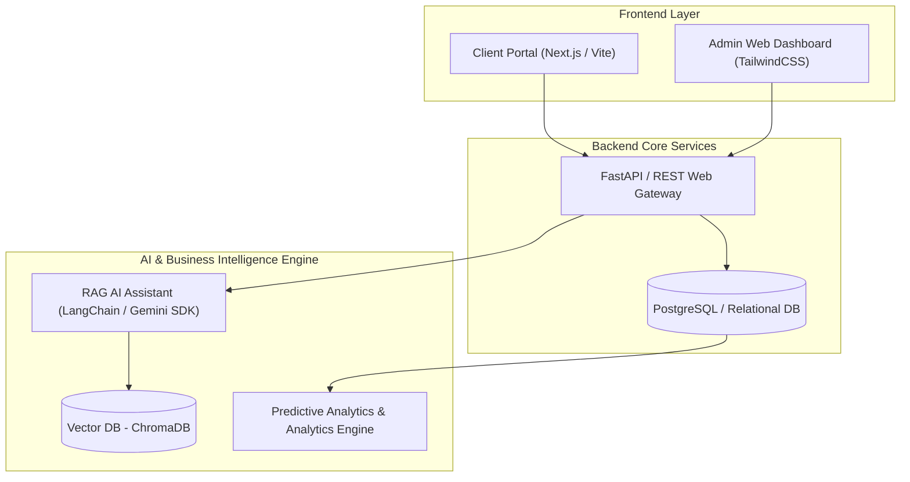

# Apex Field Systems - Asset Operations Platform (EquipTrack)

[](https://www.python.org/)
[]()
[]()
[]()

The **Apex Asset Operations Platform (AAOP / EquipTrack)** is an internal fleet management, customer account tracking, and rental transaction platform for industrial heavy machinery (generators, excavators, trenchers, commercial dehumidifiers, and mobile lighting rigs).

Built using pure Python standard library modules, it enforces state transition locks, maintenance cycles based on machine run-hours, custom domain validations, and persistent file-based JSON storage across terminal operator restarts.

---

## 📊 Project Completion Status (80% Completed)

```text
Overall Platform Completion: [████████████████░░░░] 80%
```

| Module / System Component | Implementation Status | Completion % | Key Delivered Features |
| :--- | :---: | :---: | :--- |
| **1. Customer Accounts & Credit Standing** | `completed` | **100%** | Account registration, `@gmail` / 11-digit phone validation, credit verification, delinquency flagging |
| **2. Rental Operations & Checkout Desk** | `completed` | **100%** | Dispatch workflow (`CNTR-XXXX`), return checkout, 1.5x late penalties, fuel surcharges ($5/gal + $50 fee), receipt lookup |
| **3. Service & Maintenance Operations** | `completed` | **100%** | `MaintenanceLog` model & magic methods, mechanic checkout, status restoration, historical logbook history |
| **4. Fleet Inventory & Equipment Models** | `completed` | **100%** | `BaseEquipment` / `PoweredEquipment` OOP inheritance, status transitions, run-hour & fuel tracking |
| **5. Reports & Analytics Engine** | `in-progress` | **25%** | CLI dashboard (`report_ui.py`) created; utilization, revenue yields, & repair cost algorithms in progress |

---

## 📂 Project Architecture

The application enforces strict **Layered Architecture**:

$$\text{CLI Menu Interface } (\text{\texttt{main.py}}) \longrightarrow \text{Service Layer } (\text{\texttt{services/}}) \longrightarrow \text{Repository Layer } (\text{\texttt{repositories/}}) \longrightarrow \text{JSON Disk Storage } (\text{\texttt{storage/}})$$

```text
apex_asset_platform/
│
├── main.py                     # Application entry point & CLI navigation loop
│
├── interface/                  # Terminal User Interface modules
│   ├── fleet_management_ui.py  # Fleet catalog & maintenance UI handlers
│   ├── customer_management_ui.py# Customer account registration & filtering UI
│   ├── rental_management_ui.py # Rental Desk dispatch, return & contract lookup UI
│   ├── maintenance_management_ui.py# Service & maintenance operations UI
│   └── report_ui.py            # Reports & Analytics CLI dashboard UI
│
├── models/                     # Core domain entities (Encapsulated OOP)
│   ├── contract_model/
│   │   └── contract.py         # Rental agreement domain model (encapsulated @property getters/setters)
│   ├── customer_model/
│   │   └── customer.py         # Customer account domain model (@property getters/setters)
│   ├── fleet_management_models/
│   │   ├── base_equipment.py   # Abstract/Base Equipment class
│   │   ├── powered_equipment.py# Specialized engine-driven equipment model
│   │   └── enum.py             # EquipmentStatus & EquipmentType enums
│   └── maintenance_log.py      # Service event record model
│
├── services/                   # Business logic orchestration layer
│   ├── fleet_service.py        # Fleet inventory management & service auto-flagging
│   ├── customer_service.py     # Customer registration, status update & search service
│   ├── rental_service.py       # Rental lifecycle & billing calculations
│   └── report_service.py       # Analytical summaries and yield metrics
│
├── repositories/               # Data access layer
│   └── json_repository.py      # Safe JSON file serialization & disk persistence
│
├── exceptions/                 # Custom domain error definitions
│   └── custom_exceptions.py
│
├── utils/                      # Shared helper utilities
│   ├── validators.py           # Unique ID, @gmail.com, and phone format validators
│   └── formatters.py           # CLI table formatting & currency display
│
├── data_sample/                # Initial seed CSV data files
│   ├── fleet.csv               # Seed equipment inventory CSV
│   ├── customers.csv           # Seed customer accounts CSV
│   ├── contracts.csv           # Seed rental contracts CSV
│   └── maintenance.csv         # Seed maintenance logs CSV
│
└── storage/                    # Persistent JSON storage directory
    ├── fleet.json              # Equipment catalog records
    ├── customers.json          # Customer account records
    ├── contracts.json          # Rental history & contract records
    └── maintenance.json        # Service event logs
```

---

## 🚀 Getting Started

### Prerequisites
- Python 3.10+ (required for `match/case` structural pattern matching)

### Running the Terminal App
From the workspace root directory, start the CLI application loop:
```bash
python apex_asset_platform/main.py
```

---

## 🛠️ Implemented Features & Core Modules

### 1. Fleet Management Module
- **Equipment Registration**: Add static or engine-powered heavy machinery with custom rates, purchase years, and maintenance thresholds.
- **Run-Hour & Fuel Tracking**: Record machine operating hours and fuel tank levels for powered equipment.
- **Automatic Service Flagging**: Automatically transition equipment status to `IN_MAINTENANCE` when operating hours cross maintenance intervals.
- **Catalog Filtering**: View machinery filtered by operational status (`AVAILABLE`, `IN_MAINTENANCE`, `RENTED`).

### 2. Customer Accounts & Credit Standing Module
- **Account Registration**: Store business client profiles with unique generated `CUST-XXXX` IDs.
- **Validation Guardrails**: Enforce `@gmail.com` domain validation and `09XX-XXX-XXXX` (11-digit) phone number formatting via reusable utility validators.
- **Credit Verification & Delinquency Handling**: Track client credit standing (`has_unpaid_balance`) to block delinquent accounts from initiating new rentals.
- **Status Filtering**: View customer directories filtered by standing (`PAID` / `Good Standing` vs `UNPAID` / `Delinquent`).

### 3. Rental Operations & Checkout Module
- **Issue Rental Contract**: Bind registered customers to available equipment for defined rental durations, generating unique `CNTR-XXXX` contract receipts.
- **Process Return & Checkout**: Record actual return date, meter run-hours, and returned fuel levels to automatically calculate late return penalties (1.5x daily rate) and refueling surcharges ($5.00/gal + $50 servicing fee).
- **Automated State Synchronization**: Seamlessly updates machinery run-hours, auto-flags `IN_MAINTENANCE` status via engine service thresholds (`requires_service()`), and flags customer accounts `UNPAID` / delinquent if return invoices remain unpaid.
- **Active Agreement Directory & Contract Lookup**: View real-time active contracts currently on rent or perform instant receipt searches by unique Contract ID.

---

## 🔮 Future System Architecture & Enterprise Roadmap

To scale **EquipTrack** from a local CLI application into an enterprise-grade Asset Operations & Intelligence Platform, the following Phase 2 & Phase 3 extensions are planned:



### 1. Client Portal & Admin Web Dashboard (Frontend)
- **Customer Self-Service Web Portal**: A responsive Next.js / Vite web application allowing clients to browse real-time fleet availability, estimate rental costs, request quotes, and manage active contracts.
- **Admin & Yard Operator Dashboard**: An intuitive TailwindCSS web panel for front-desk operators and yard mechanics featuring interactive terminal maps, real-time machine telemetry, and dispatch scheduling.

### 2. Enterprise Relational Database Engine Integration
- **PostgreSQL / SQLite Storage Engine**: Migrate from local JSON file storage to a scalable relational database engine.
- **ORM & Transaction Safety**: Integrate SQLAlchemy ORM with ACID transaction safety, foreign key integrity constraints, and automated database migrations via Alembic.

### 3. RAG (Retrieval-Augmented Generation) & AI Operator Assistant
- **Vector Knowledge Base**: Index equipment operator manuals, manufacturer service specs, and historical maintenance logs in ChromaDB / Qdrant.
- **LLM Maintenance Assistant**: Integrate Gemini SDK / LangChain to power a natural-language AI assistant for yard mechanics (e.g. *"What is the 500-hour service checklist for Cat 320 Excavator?"* or *"Analyze common failure causes for diesel generators this quarter"*).
- **Natural Language Dispatch Queries**: Enable operators to query inventory conversationally (e.g. *"Find me an available 100kW generator near Yard B for a 3-day rental"*).

### 4. Data Analytics & Business Intelligence Engine
- **Predictive Maintenance Analytics**: Machine learning models forecasting component wear and service deadlines based on daily run-hour accumulation rates.
- **Fleet Utilization & Yield Analytics**: Visual analytics dashboards tracking downtime percentages, asset ROI, revenue breakdowns (base rates vs. penalty fees), and dynamic rental pricing algorithms.
